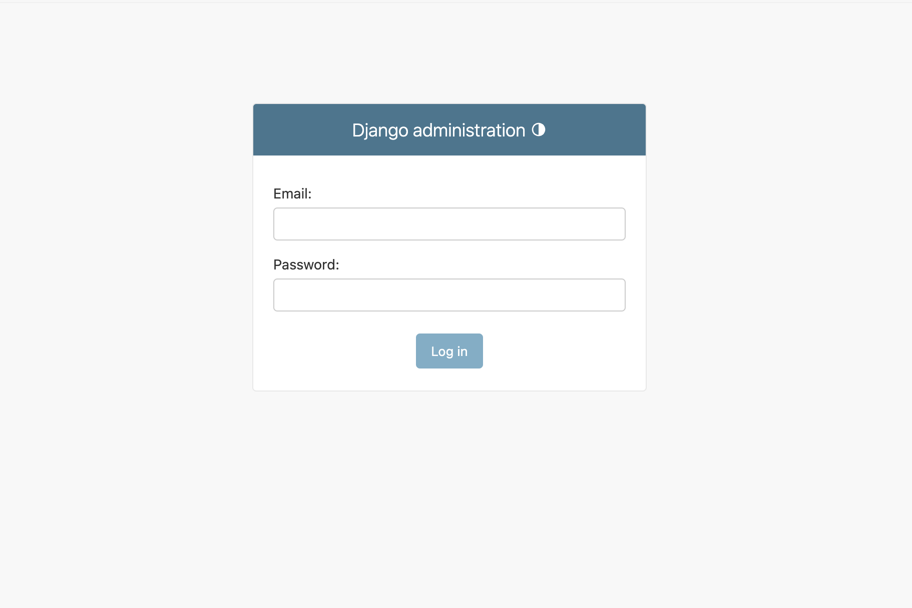
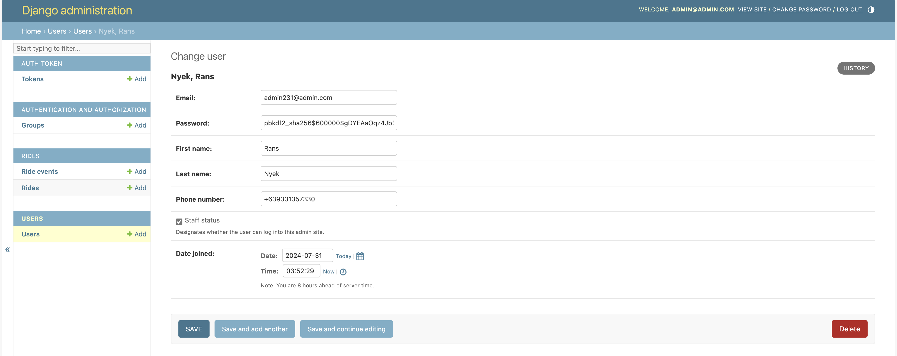

<div align="center">

  <h1><a href="https://github.com/johnmartindc/wingz-test">Wingz Django Assessment</a></h1>
  
  <p>
    README
  </p>

</div>

<br />

<!-- Table of Contents -->
# Table of Contents

- [Table of Contents](#table-of-contents)
  - [About the Project](#about-the-project)
    - [Tech Stack](#tech-stack)
    - [Ride API](#ride-api)
  - [Getting Started](#getting-started)
    - [Installation](#installation)
    - [Special Note](#special-note)
    - [Run Locally](#run-locally)
    - [Admin Site](#admin-site)
  - [API Usage](#api-usage)
    - [User related endpoints:](#user-related-endpoints)
      - [/users/login/ `POST`](#userslogin-post)
      - [/users/register/ `POST`](#usersregister-post)
      - [/users/logout/ `POST`](#userslogout-post)
    - [Ride endpoints:](#ride-endpoints)
      - [/api/rides/ `GET` `POST`](#apirides-get-post)
      - [/api/rides/\<-id\> `GET` `PUT` `DELETE`](#apirides-id-get-put-delete)
      - [/api/rides/sort\_by\_distance `GET`](#apiridessort_by_distance-get)
      - [/api/ride\_events/ `GET` `POST`](#apiride_events-get-post)
      - [/api/ride\_events/\<-id\> `GET` `PUT` `DELETE`](#apiride_events-id-get-put-delete)
  

<!-- About the Project -->
## About the Project

<div align="center"> 
  <p> This project was created as submission to the Wingz Django assessment
</div>


<!-- TechStack -->
### Tech Stack

  <ul>
    <li>Python</li>
    <li>Django</li>
  </ul>

<!-- Features -->
### Ride API

- supports CRUD operations
- paginated with default page size of 10
- filter by status, rider email
- sorting by pickup time
- sorting by distance from input GPS distance
- utilizes DRF token authentication


<!-- Getting Started -->
## Getting Started

<!-- Prerequisites -->
### Installation

Clone the project

```bash
  git clone https://github.com/johnmartindc/wingz-test.git
```

Using python3.9, create a virtual env and activate

```bash
   python3.9 -m venv .venv
   source PATH_TO_VENV/bin/activate
```

from the root folder, install dependencies

```bash
  pip install -r requirements.txt
```

### Special Note
If you're on a non-MacOS machine, please comment out the following in `wingz_test/wingz_test/settings.py`:
```bash
  GDAL_LIBRARY_PATH
  GEOS_LIBRARY_PATH
```


<!-- Run Locally -->
### Run Locally


Go to the project directory

```bash
  cd wingz_test
```

Initialize database

```bash
  python manage.py makemigrations
  python manage.py migrate
```

Create superuser

```bash
  python manage.py createsuperuser
```

Run server
```bash
  python manage.py runserver
```


### Admin Site
By default, admin site will be in `localhost:8000/admin`

Login using the created super user


Select a created user and enable staff status


<!-- Usage -->
## API Usage

### User related endpoints:

#### /users/login/ `POST`
Required fields:
- `email`
- `password`

<hr>
  
#### /users/register/ `POST`
Required fields:
- `email`
- `phone_number`
- `password`
- `password2` (must be same with password)
- `first_name`
- `last_name`

<hr>

#### /users/logout/ `POST`
No required fields but needs an attached auth token

<hr>

### Ride endpoints:
To gain permission for these endpoints, attach a Authorization Token in the request header.
<hr>

#### /api/rides/ `GET` `POST`
Returns the ride list

Optional parameters:
- `status` (filter)
- `email` (filter)
- `sort` (possible values: `status`, `rider`, `driver`, `pickup_time`)
- `ascending` (set to "true" if ascending, otherwise it will return a descending response)
<hr>

#### /api/rides/<-id> `GET` `PUT` `DELETE`
Returns ride details
<hr>

#### /api/rides/sort_by_distance `GET`
Returns ride list sorted by distance given gps inputs

Required parameters:
- `latitude`
- `longitude`
#### /api/ride_events/ `GET` `POST`
Returns ride events list
<hr>

#### /api/ride_events/<-id> `GET` `PUT` `DELETE`
Returns ride event details
<hr>